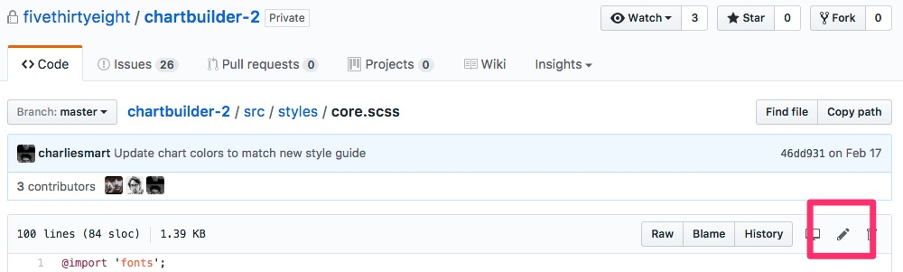

# GitHub

Now that we've pushed our code to GitHub, lets explore the features that it adds.

1. Collaboration. This is HUGE! Github has a lot of great features to help you collaborate with your team.
2. Open Source. This is ALSO HUGE! Strangers can see your code and participate with you on your project. They can suggest fixes, point out errors, and start discussions. You can find other people's work, and make sure you're not duplicating something that already exists. Or you can interact with someone who has already worked on something similar to what you're trying to tackle.
3. Web Hosting! The GithubPages feature allows you to host a static website for free, right on GitHub.
4. A better visual interface. In the last lesson you learned how to merge branches locally. In this lesson we'll learn how to do the same on GitHub. Many of the functions you can perform locally are nicer to perform on GitHub's great web interface.

## Lets Dive In!

Remember, there are now two copies of your repository, your **local repository** which sits on your computer, and your **remote repository** which is on GitHub. Lets take a look a the remote repository that is on GitHub.

* https://github.com/dmil/my-simple-website

## (Some of) GitHub's Features

### The `README.md` file

Github looks for a "readme" file and renders it as you're navigating through the file structure. This is a great way to guide people through your code.


Its particularly evident on our data repository, where the overall repository has a readme, but each folder also contains its own readme.

* https://github.com/fivethirtyeight/data

Readme files are often given the `.md` extension, meaning they're written in a language called markdown that allows for nicer formatting. You can check out this [markdown cheet sheet](https://beegit.com/markdown-cheat-sheet) if you want to see how formatting works, but you can also save a readme files as plain text. Github will also detect `.txt` files, or you can just write plain text inside your `.md` file.

## Commit log

Commit Log

* https://github.com/dmil/my-simple-website/commits/master

## History, Raw, and Blame for any file

* File
	* https://github.com/fivethirtyeight/chartbuilder-2/blob/master/src/styles/core.scss
	* 
* History
	* https://github.com/fivethirtyeight/chartbuilder-2/commits/master/src/styles/core.scss
* Blame
	* https://github.com/fivethirtyeight/chartbuilder-2/blame/master/src/styles/core.scss

## Editing files inside GitHub


## Drag and Drop


## Collaboration

Add `dmil` (that's me!) as a collaborator. Now I can push to your repository. Collaborators can push to the repository without asking your permission, they have full read and write access.


If I wasn't a collaborator, I could still work with you on an open source project through a process called forking where I can make a copy of your repository in my GitHub account, make changes, and request that you merge them back into your project. We will discuss forking more in depth later.

## Serving up Websites!

GitHub is also great for serving up static websites. Right now, you have the code for your website on GitHub, but its not being served up anywhere. GitHub is only storing the code. Luckily, if your code happens to be a website, GitHub can also host it for you through a feature called "GitHub Pages". 

Simply go to the "settings" menu, scroll down to "GitHub Pages", and select "master branch"


Whatever is in your master branch on GitHub should now appear at 

```
http://your-username.github.io/repository-name
```

in my case it is [**http://dmil.github.io/my-simple-website**](http://dmil.github.io/my-simple-website)

## Pull Requests

In the previous tutorial we merged branches locally on our computer. This is, however, not ideal when working on projects with other people. The best practice is to issue pull requests on GitHub. 

A **pull request** is a request to merge one branch into another branch. Right now our repository only has one branch, so we cannot issue a pull request.

* https://github.com/dmil/my-simple-website/branches

Lets demonstrate how branches are merged by creating a new branch

### Step 1: Create a new branch LOCALLY called `poke-fox`

1. Pick an image of a fox from the internet and replace the image on your site with this new fox image. I'm going with this one, the URL is below.

	[https://s0.wp.com/wp-content/themes/vip/espn-fivethirtyeight/assets/images/logo-fox-head-color.svg](https://s0.wp.com/wp-content/themes/vip/espn-fivethirtyeight/assets/images/logo-fox-head-color.svg)
	
	

	Commit this change with a descriptive commit message like "change image to fox"

2. Add this code in a file called `main.js`

	```
	//define a function
	function sayDontPoke() {
		alert('dont poke the fox');
	}
	
	// refer to a function
	document.querySelector('img').onclick = sayDontPoke
	
	// call a function
	sayDontPoke()
	```
	
	Commit this change with a descriptive commit message like "alert message when fox image is clicked"
	
### Step 2: Push this new branch to GitHub (don't merge it locally!)


	
Now when you naviate to your GitHub repo, you should see both branches


### Step 3: Issue a pull-request from the `poke-fox` branch to the `master` branch

Navigate to the repository on GitHub, then click on the navigation bar where it says "2 branches" as shown below.


That should bring you to this screen where you can view all of your branches and issue a pull request back.


Then you will arrive at this screen


1. Add a descriptive message
3. look at all the commits that are different on this branch from `master`
3. review which files where changed
4. "Create pull request"

### Step 4: Merge this pull request into your master branch

Normally, when working collaboratively, this is the phase where discussions begin. Other collaborators will review what you intend to merge in, and then when you have agreed to add this new code/text/data/etc to the `master` branch, someone on the team can hit "Merge pull request".


Once you're done with that, you can delete the branch! 


### Step 5: Fetch the remote changes (changes that happened in GitHub) onto your local computer.

The merging of `poke-fox` into `master` happened on GitHub, however, your local machine still doesn't know about these changes. Also, if you were working on a project with someone else, your local computer would also not know about the changes your collaborators have made to the project either. Therefore, we have to go back to our local computer and fetch the new changes on each branch.


You'll notice when you do this for the `poke-fox` branch (as shown in the image below), the fetch button changes to "Publish this branch to GitHub".

### Step 6: Delete local branches you aren't using

Since we have deleted the branch `poke-fox` branch on github, it now exists on our local computer, but doesn't exist on github. I like to clean up my local computer whenever I can to remove branches I'm no longer using. You can delete the `poke-fox` branch as shown in the image below.


## Recap: The GitHub Collaborative Workflow

[images/Presentation2.pptx](images/Presentation2.pptx)

1. Open your local GitHub for Mac app to the repository you're working in
2. Pull the latest `master` from GitHub
3. Switch to the `feature-branch` you intend to work on
4. Pull the latest of `feature-branch` from GitHub
5. **work then commit, work then commit, work then commit ...**
6. Push the `feature-branch` to GitHub
7. Issue a Pull Request on GitHub from the `feature-branch` to `master`
8. Merge the Pull Request into `master` on GitHub
9. Delete the **remote**`feature-branch` on GitHub
10. Pull `master` **locally** back to your computer
11. Delete `feature-branch` locally


## Alternate workflow (for yourself)

1. Do whatever you want locally and don't make changes directly on GitHub
2. Keep pushing all branches to GitHub at regular intervals
